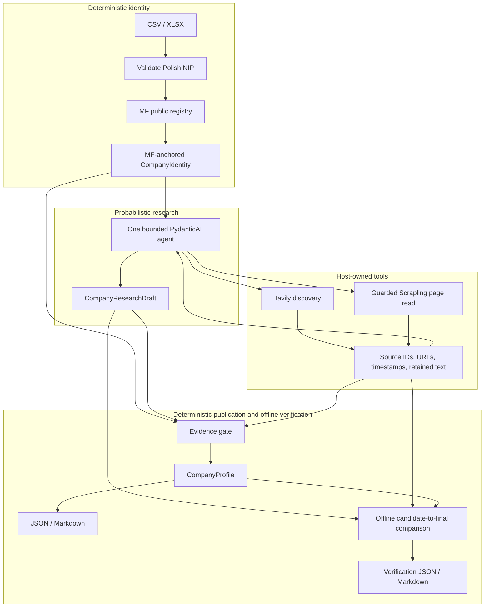

# Company BI

A research agent may propose broadly; deterministic publication recognizes only a narrow finite contract and abstains when meaning is outside it. This is not general language understanding or a useful broad-coverage research claim.

Under the [strict publication contract](docs/STRICT_PUBLICATION_CONTRACT.md), the one quoted direct assertion shown here is supported: `Example sp. z o.o. offers "cloud services".` The plausible unquoted assertion `Example sp. z o.o. offers cloud services.` is true but out of contract, so publication abstains. Labels are opaque, not a vocabulary of validated meanings.

**v0.1.1 remains BLOCKED.** Boundary corrections pass **262/262** canonical CLI cases, **26/26** local CLI smoke cases and **683 tests**. A fresh external release holdout and exact-candidate hosted CI remain pending. Retained Asseco and SONEL each publish **0 researched facts**—strict abstention, not useful BI. See the [current evidence and missing prerequisites](docs/FINAL_BOUNDARY_REVIEW.md); earlier measurements below remain separate history.

## Historical evidence (earlier contract)

The earlier-contract fixed populations remain distinct: **47/47** historical overall supported precision, **5/19** eligible researched recall, **0/7** retained-real researched yield, and **1/13** locked-candidate support in the separate two-company utility set (with 0 incorrect observed). Three earlier live end-to-end runs produced zero supported researched observations. These numbers predate the strict contract; none establishes strict-contract performance, population-level accuracy, or useful coverage. The prior blocked `66dbbc89` failures and missing original Astra/Opus envelopes remain limitations, not results repaired by this docs edit; see the [quality report](docs/V0_1_1_QUALITY.md#11-frozen-remediation-candidate-blocked) for the preserved blocker record.

## Offline review

The [reviewer guide](REVIEWER_GUIDE.md) provides the verified zero-key path using `examples/strict_contract/`. Frozen controlled/real-company inputs and the [Asseco](examples/review/asseco-poland-verification.md) / [Sonel](examples/review/sonel-20261005.md) generated reports remain earlier-contract evidence; they are not strict positives and may be rejected for provenance or assertion-unit mismatch.

The verifier inspects a supplied retained run; it does not authenticate arbitrary edited JSON, fetch sources, or prove that a publisher is truthful. Pydantic structured output validates shape, not truth. Unknown semantics remain unpublished rather than inferred.

## Product and evaluation limits

Not demonstrated: production autonomous coverage or population-level precision; universal semantic verification; comprehensive financial extraction; reliable real-company researched yield; or general superiority of a retrieval approach. A finite grammar can abstain on true prose outside its productions. Zero incorrect observations in a small population is not precision proof.

## Zero-key offline review

Use the strict matrix's canonical saved runs as zero-key review inputs without re-research or network access:

```sh
uv sync --frozen --python 3.12
uv run --frozen company-bi verify examples/strict_contract/supported.json --output-dir /tmp/company-bi-strict-supported
```

This writes profile and verification JSON/Markdown. The saved `supported`, `out_of_contract`, `unsafe`, and `identity_invalid` inputs exercise distinct outcomes: only `supported` publishes the researched service; the next two abstain, and invalid identity exits `2` without a profile. [Observed results](docs/FINAL_BOUNDARY_REVIEW.md) · [normative contract](docs/STRICT_PUBLICATION_CONTRACT.md) · [adjudication](docs/HOLDOUT_ADJUDICATION.md).

The existing `examples/verification/` fixtures and frozen real-company runs are earlier-contract examples. They can be inspected with the offline verifier, but are not strict positives and may be rejected for legacy-format provenance or assertion-unit mismatch.

```sh
uv run --frozen company-bi verify examples/verification/controlled-financial-sign.json --output-dir outputs/verification
```

Legacy inputs are historical probes, not strict positives. A rejected legacy envelope exits `2` before producing a profile; it does not demonstrate execution of the research grammar.

## Architecture and report interpretation



The model may choose searches and propose facts; deterministic code owns identity, source IDs, retained evidence, and publication. The strict gate accepts only complete recognized assertion units from eligible retained full-page material; when meaning is unknown or outside the finite grammar, it abstains. **Pydantic structured output validates shape, not truth.** The verifier checks the supplied retained run and its ledger; it does not authenticate arbitrary edited JSON or prove that a publisher is truthful. No source text is fetched during verification.

Exit `0` means verification completed, even if facts were downgraded or cleared; it does **not** mean every candidate claim is supported. Preserved uncertain/unknown facts remain non-supported, not accepted. Invalid input, gate, or file errors exit `2`. Verification does not overwrite its input. See the [reviewer guide](REVIEWER_GUIDE.md) for the strict matrix review path and interpretation.

## Evaluation and adversarial evidence

Historical frozen replay/contract metrics are retained as historical results, not results newly produced by this interface:

| Population / measure | Result |
| --- | ---: |
| Historical overall supported precision | 47/47 |
| Historical eligible researched recall | 5/19 |
| Historical retained-real eligible researched yield | **0/7** |
| Fixed two-company real-source utility set (Asseco 6 + SONEL 7), locked baseline candidates re-gated | **1/13 supported; 0 incorrect observed** |
| Asseco retained verification report | **1/6 supported** |
| Three fresh live end-to-end runs | **zero supported researched observations** |

The historical 47/47 overall count includes registry supports and does not establish autonomous research precision. The two-company 1/13 and Asseco-only 1/6 are distinct scopes; fresh-live zero-support results are another population. None establishes population-level accuracy or useful coverage. The historical replay's changed 4/19 researched recall and 15/19 over-downgrade are reported separately in the [latest quality report](docs/V0_1_1_QUALITY.md#11-frozen-remediation-candidate-blocked). The old historical LPP run failed at its single repair ceiling; its exact cause is unrecoverable. The verifier is a finite publication contract, not a general semantic-safety guarantee.

The historical frozen set selected 12 cases (9 controlled, 3 retained-real); original drafts, gold, and source snapshots remain frozen. Historical researched support precision was 5/5 and eligible recall 5/19; 5/5 is not production precision. A later adversarial review exposed finite counterexamples and corrections; those cases are regression evidence, not an untouched holdout. [Evaluation methodology](docs/EVAL_SPEC.md) · [historical results](docs/EVAL_RESULTS.md) · [adversarial corrections and current measurements](docs/ADVERSARIAL_CORRECTIONS.md) · [quality and scoped utility evidence](docs/V0_1_1_QUALITY.md).

## Experimental live research route

Live research remains an experimental, separately configured path; it is not the offline verifier. It contacts MF, Tavily, websites, and a model and may incur costs. Export `TAVILY_API_KEY` through your usual secret-management method, then use standard `codex login`. The tested path is `openai-codex:gpt-6-luna`, with SDK-managed authentication and no required `OPENAI_API_KEY`. An explicitly selected `openai:` model requires `OPENAI_API_KEY`; this is not a provider-agnostic validation claim. Optional [`.env.example`](.env.example) contains placeholders only; create an ignored `.env` without overwriting existing configuration, then explicitly add `--env-file .env` to `uv run` if using it. Never commit keys or auth caches.

```sh
uv run --frozen company-bi batch examples/research_batch.csv --output-dir outputs --runs-dir runs --model openai-codex:gpt-6-luna
```

Live results, costs, and availability vary. `research` emits a draft/run; `batch` emits final reports and `batch_summary.csv`, with retained research under `runs/`. The measured live samples above published no supported researched observations.

## Reliability, safety, and scope limits

Per-company ceilings: 180 seconds, 6 searches, 10 page reads, 2 browser attempts, 12 model requests, 24 tool calls, and one output repair. [Architecture decisions](docs/ARCHITECTURE_DECISIONS.md#og-152-bounded-research-implementation) record the bounds and trust tradeoffs.

Not production SaaS or multi-tenant; not a complete Polish financial-data platform, universal web extraction, multi-agent orchestration, or resolution of every fact. Retrieved **PDF/XML/archive/Office financial parsing is unsupported** (CSV/XLSX NIP input works). Provider/web variability remains. URL/DNS checks do **not** eliminate SSRF; DNS rebinding/TOCTOU is residual risk. Scrapling remains the full-page mechanism; its supported-fact advantage was not demonstrated in the limited paired experiment.

## Repository map

- `src/company_bi/agent.py` — bounded research; `search.py` / `fetch.py` — Tavily / guarded retrieval.
- `src/company_bi/sources.py` — host ledger; `evidence.py` — publication gate; `verification.py` — offline comparison; `renderer.py` — JSON/Markdown; `batch.py` — failure-isolated, resumable batches.
- `examples/` — controlled fixtures, input, and retained public runs; `tests/` — deterministic regressions.
- `docs/` — [evaluation methodology](docs/EVAL_SPEC.md), [historical results](docs/EVAL_RESULTS.md), [recovery](docs/RECALL_RECOVERY.md), [clean-clone audit](docs/CLEAN_CLONE_AUDIT.md), [Scrapling experiment](docs/SCRAPLING_EXPERIMENT.md).

Licensed under the [MIT License](LICENSE), copyright © 2026 Tomasz Gonczar.
