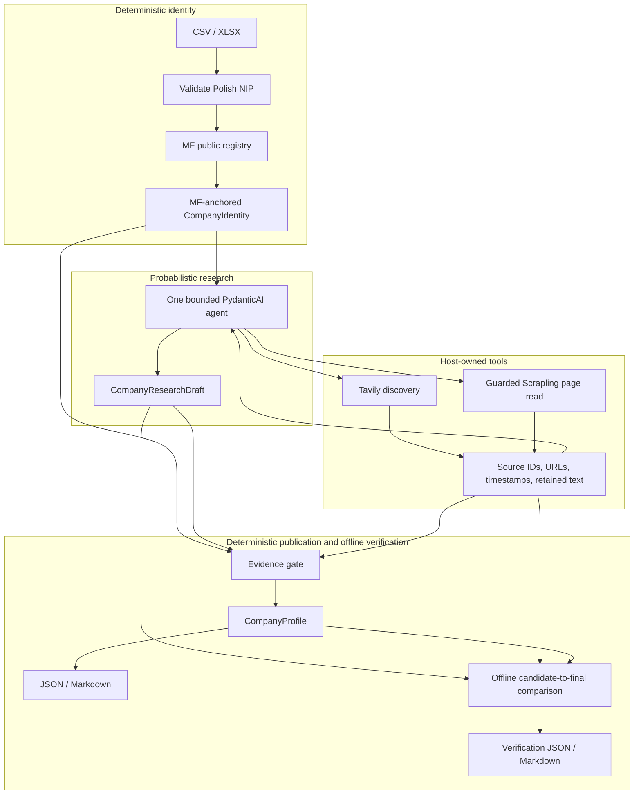

# Company BI

**A research agent proposes candidate company facts; a deterministic offline verifier decides what can be published from the retained source ledger.** The verifier replays the existing evidence gate, compares candidate with final facts, and emits a reviewable report without model, registry, search, or network calls.

## What this repository demonstrates

- Bounded PydanticAI research that proposes candidate facts; deterministic Polish NIP validation anchors legal identity.
- Retained provenance, claim-specific evidence checks, publication abstention, replay, and failure isolation; adversarial regression tests exercise defined gate cases.
- The supported / uncertain / unknown evidence states and a candidate → verified workflow make accepted, downgraded, cleared, and preserved outcomes inspectable.

**Utility remains weak and experimental.** In the fixed two-company real-source utility set (Asseco Poland: 6 eligible observations; SONEL: 7), the locked baseline candidates re-gated by the current verifier yielded **1/13 supported researched observations, with 0 incorrect observed**. The Asseco report alone is **1/6**. This is not 1/1 production precision. Three fresh live end-to-end runs published **zero supported researched observations**. Historical frozen replay results are a separate population: **47/47 overall supported precision, 5/19 eligible researched recall**, with historical retained-real researched yield **0/7**. The earlier failed pass and its limitations remain historical evidence; this interface does not claim to fix them.

**Release status: v0.1.1 is BLOCKED.** The finite deterministic verifier applies a publication contract to facts proposed by research; adversarial evaluation measures both unsafe acceptance and conservative rejection. Autonomous coverage remains experimental. The frozen candidate has a known unsafe financial-qualifier regression and three full-suite failures. See [the latest quality report](docs/V0_1_1_QUALITY.md#11-frozen-remediation-candidate-blocked) for separate populations and remaining limits.

Not demonstrated: production autonomous coverage or population-level precision; universal semantic verification; comprehensive financial extraction; reliable real-company researched yield; or general superiority of a retrieval approach. Zero incorrect observations in a small population is not precision proof.

## Verify one controlled candidate offline

Requires `uv`; setup selects Python 3.12 and may download it and dependencies. The commands below need no API key, login, browser, or network service call after setup.

```sh
uv sync --frozen --python 3.12
uv run --frozen company-bi verify examples/verification/controlled-financial-sign.json --output-dir outputs/verification
```

The command writes four files: `profile.json`, `profile.md`, `verification.json`, and `verification.md`. The controlled fixture demonstrates an explicitly current product being accepted while a candidate **+PLN 10m net result** is rejected against retained evidence of a standalone **−PLN 10m net loss**. This is a synthetic example, not real-company yield.

Other controlled examples:

```sh
uv run --frozen company-bi verify examples/verification/controlled-planned-activity.json --output-dir outputs/verification-planned
uv run --frozen company-bi verify examples/verification/controlled-current-service.json --output-dir outputs/verification-current
```

The planned cloud-service fixture demonstrates a future plan downgraded rather than published as a current offering; the current-service fixture is a positive controlled example.

## Architecture and report interpretation



The model chooses searches, sources, and candidate interpretations—not which legal entity the user meant or whether a claim may be published. Host tools assign source IDs and retain metadata/text. Supported research requires eligible retained evidence and claim-specific context checks. **Pydantic structured output validates shape, not truth.** The verifier checks the supplied retained run and its ledger; it does not authenticate arbitrary edited JSON or prove that a publisher is truthful. No source text is fetched during verification.

For a real retained input, verify into a separate output directory:

```sh
uv run --frozen company-bi verify examples/utility_v011/runs/baseline/asseco-poland.json --output-dir outputs/asseco-verification
```

[`examples/review/asseco-poland-verification.md`](examples/review/asseco-poland-verification.md) is a **REAL RETAINED VERIFICATION**, not successful BI or fresh research. It reports exactly one researched support out of Asseco's six eligible observations (**1/6**). The combined fixed real-source utility set covers Asseco (6) and SONEL (7), with 1/13 supported researched observations. The input is an existing retained run; the command is offline.

Exit `0` means verification completed, even if facts were downgraded or cleared; it does **not** mean every candidate claim is supported. Preserved uncertain/unknown facts remain non-supported, not accepted. Clearing can be partial: for example, an event may remain supported while an unverified occurrence date is cleared; inspect the final snapshot and changed paths. A valid run with failed research diagnostics produces only `verification.json` and `verification.md`, status `not_published`, no profile, and exit `1`. Invalid input, gate, or file errors exit `2`. Verification does not overwrite its input.

## Evaluation and adversarial evidence

Historical frozen replay/contract metrics are retained as historical results, not results newly produced by this interface:

| Population / measure | Result |
| --- | ---: |
| Historical overall supported precision | 47/47 |
| Historical eligible researched recall | 5/19 |
| Historical retained-real eligible researched yield | **0/7** |
| Fixed two-company real-source utility set (Asseco 6 + SONEL 7), locked baseline candidates re-gated | **1/13 supported; 0 incorrect observed** |
| Asseco retained verification report | **1/6 supported** |
| Three fresh live end-to-end runs | **zero supported researched observations** |

The historical 47/47 overall count includes registry supports and does not establish autonomous research precision. The two-company 1/13 and Asseco-only 1/6 are distinct scopes; fresh-live zero-support results are another population. None establishes population-level accuracy or useful coverage. The historical replay's changed 4/19 researched recall and 15/19 over-downgrade are reported separately in the [latest quality report](docs/V0_1_1_QUALITY.md#11-frozen-remediation-candidate-blocked). The old historical LPP run failed at its single repair ceiling; its exact cause is unrecoverable. The verifier is a finite publication contract, not a general semantic-safety guarantee.

The historical frozen set selected 12 cases (9 controlled, 3 retained-real); original drafts, gold, and source snapshots remain frozen. Historical researched support precision was 5/5 and eligible recall 5/19; 5/5 is not production precision. A later adversarial review exposed finite counterexamples and corrections; those cases are regression evidence, not an untouched holdout. [Evaluation methodology](docs/EVAL_SPEC.md) · [historical results](docs/EVAL_RESULTS.md) · [adversarial corrections and current measurements](docs/ADVERSARIAL_CORRECTIONS.md) · [quality and scoped utility evidence](docs/V0_1_1_QUALITY.md).

## Experimental live research route

Live research remains an experimental, separately configured path; it is not the offline verifier. It contacts MF, Tavily, websites, and a model and may incur costs. Export `TAVILY_API_KEY` through your usual secret-management method, then use standard `codex login`. The tested path is `openai-codex:gpt-6-luna`, with SDK-managed authentication and no required `OPENAI_API_KEY`. An explicitly selected `openai:` model requires `OPENAI_API_KEY`; this is not a provider-agnostic validation claim. Optional [`.env.example`](.env.example) contains placeholders only; create an ignored `.env` without overwriting existing configuration, then explicitly add `--env-file .env` to `uv run` if using it. Never commit keys or auth caches.

```sh
uv run --frozen company-bi batch examples/research_batch.csv --output-dir outputs --runs-dir runs --model openai-codex:gpt-6-luna
```

Live results, costs, and availability vary. `research` emits a draft/run; `batch` emits final reports and `batch_summary.csv`, with retained research under `runs/`. The measured live samples above published no supported researched observations.

## Reliability, safety, and scope limits

Per-company ceilings: 180 seconds, 6 searches, 10 page reads, 2 browser attempts, 12 model requests, 24 tool calls, and one output repair. [Architecture decisions](docs/ARCHITECTURE_DECISIONS.md#og-152-bounded-research-implementation) record the bounds and trust tradeoffs.

Not production SaaS or multi-tenant; not a complete Polish financial-data platform, universal web extraction, multi-agent orchestration, or resolution of every fact. Retrieved **PDF/XML/archive/Office financial parsing is unsupported** (CSV/XLSX NIP input works). Provider/web variability remains. URL/DNS checks do **not** eliminate SSRF; DNS rebinding/TOCTOU is residual risk. Scrapling remains the full-page mechanism; its supported-fact advantage was not demonstrated in the limited paired experiment.

## Repository map

- `src/company_bi/agent.py` — bounded research; `search.py` / `fetch.py` — Tavily / guarded retrieval.
- `src/company_bi/sources.py` — host ledger; `evidence.py` — publication gate; `verification.py` — offline comparison; `renderer.py` — JSON/Markdown; `batch.py` — failure-isolated, resumable batches.
- `examples/` — controlled fixtures, input, and retained public runs; `tests/` — deterministic regressions.
- `docs/` — [evaluation methodology](docs/EVAL_SPEC.md), [historical results](docs/EVAL_RESULTS.md), [recovery](docs/RECALL_RECOVERY.md), [clean-clone audit](docs/CLEAN_CLONE_AUDIT.md), [Scrapling experiment](docs/SCRAPLING_EXPERIMENT.md).

Licensed under the [MIT License](LICENSE), copyright © 2026 Tomasz Gonczar.
