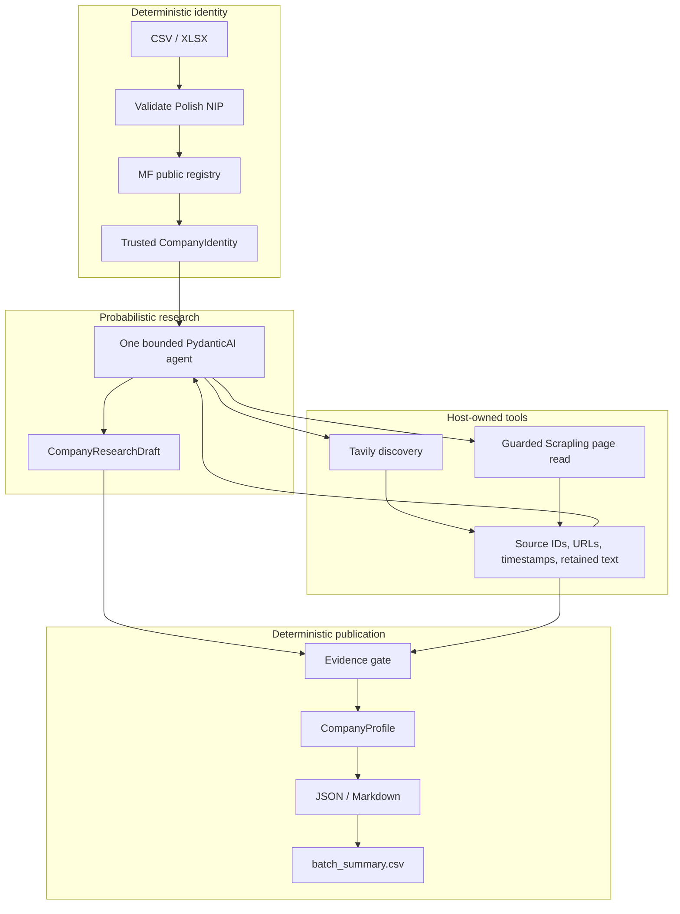

# Company BI

**CSV/XLSX with Polish NIPs → registry-anchored company research → JSON and Markdown with explicit evidence gaps.** One bounded PydanticAI agent proposes facts; deterministic identity checks, an evidence gate and ordinary renderers decide what may be published.

**Current status: PRODUCT UTILITY NOT YET DEMONSTRATED.** The corrective candidate passes the exercised publication/replay boundaries, but the latest **five live company runs published zero supported non-registry observations**: three PARTIAL reports and two failures. Four separate fixed-source extraction runs also yielded zero supported research. This is an inspectable engineering portfolio project, not a proven BI product or production certification.

Real example: **NIP `8840033448` → SONEL → PARTIAL**, generated on 2026-10-05. Open the [actual Markdown](examples/review/sonel-20261005.md), [JSON](examples/review/sonel-20261005.json) and [producing commit/command/run provenance](examples/review/sonel-20261005.provenance.json).

The retrieved [official offer page](https://sonel.pl/en/about) says: “The company offers a wide range of products, including meters, analyzers, and thermal imaging cameras.” That useful evidence is retained as `S007`, but the final products field remains **uncertain**, not `supported`. The example exposes the remaining publication-coverage bottleneck rather than disguising abstention as success. Follow the [10-minute reviewer guide](REVIEWER_GUIDE.md).

## Quick deterministic verification

Requires `uv`; setup selects Python 3.12 and may download it and dependencies. **No Tavily key or model credentials are required.** Tests, evaluation and offline review need no login, browser installation or prior run state.

```sh
uv sync --frozen --python 3.12
uv run --frozen pytest -q
uv run --frozen company-bi eval --dataset examples/evals/dataset.json --output-dir outputs/evals
uv run --frozen python scripts/review_offline.py --output-dir outputs/review
```

Evaluation prints the frozen counts and writes `outputs/evals/results.md` plus JSON. The helper writes provenance-labeled examples below. Setup download time is separate from the short offline checks.

## Architecture



The model chooses searches, sources and candidate interpretations—not which legal entity the user meant. Host tools assign source IDs and retain metadata/text. Research citations must reference that ledger; supported research requires exact retained full-page excerpts and claim-specific entity/context checks. **Pydantic structured output validates shape, not truth.** Gate and renderers make no model calls. Batch isolates failures and checkpoints on the filesystem.

Per-company ceilings: 180 seconds, 6 searches, 10 page reads, 2 browser attempts, 12 model requests, 24 tool calls and one output repair. [Architecture decisions](docs/ARCHITECTURE_DECISIONS.md#og-152-bounded-research-implementation) record the bounds and trust tradeoffs.

## Example output

The committed Sonel example above is **LIVE END-TO-END, PARTIAL**, produced by `9f7c2d2`; it is not output from a new zero-key model run. No useful supported real-company example was obtained in this pass.

Run the offline helper, then open `outputs/review/review-manifest.json` and:

| Example | Generated artifact | Provenance |
| --- | --- | --- |
| PARTIAL | `outputs/review/retained/asseco-poland.md` and `.json` | **REAL RETAINED RUN**, republished through the current gate; not fresh research |
| COMPLETE | `outputs/review/controlled/synthetic-complete.md` and `.json` | **CONTROLLED FIXTURE** from `examples/profiles/complete.json`; not real yield |
| FAILED | `outputs/review/controlled/provider-interruption-research.json` | **CONTROLLED FAILURE**, one guarded local FunctionModel interruption; no final profile/report |

The Asseco replay preserves independent registry identity while explicitly blocking legacy source groups `S006` and `S010` whose URL relationships cannot be proved. Financial values stay null. The helper also renders LPP/ORLEN and makes no live service calls.

Sample input: [`examples/research_batch.csv`](examples/research_batch.csv) contains public Asseco, LPP and ORLEN NIPs for optional live batches. [`examples/nips.csv`](examples/nips.csv) is the helper's validation demonstration: public Asseco NIP, invalid `123`, and a synthetic fixture identifier. Checksum validity alone is not identity resolution.

## Evidence semantics

`supported`: eligible retained evidence verifies the claim and context. `uncertain`: evidence/candidate exists but cannot justify support. `unknown`: insufficient evidence; value is null, never a guessed zero/false.

`COMPLETE` means core coverage has no gap or limitation; `PARTIAL` is valid with gaps/uncertainties/unknowns; `FAILED` means no safe final profile. Unresolved/invalid identity outcomes are distinct. A research diagnostic of `completed` is not a COMPLETE profile.

## Frozen replay/contract benchmark

The selected diagnostic set has **12 cases** (9 controlled, 3 retained-real), not a representative sample. Original drafts, gold and source snapshots remain frozen. The restored corrective replay exits **0**, with these unchanged OG-154A metrics:

| Measure | Result |
| --- | ---: |
| Overall supported precision | 47/47 |
| Registry supported precision | 42/42 |
| Researched supported precision | 5/5 |
| Eligible researched recall | 5/19 |
| Unsupported facts published as supported | 0 |
| Identity correctness | 10/10 |
| Correct uncertainty handling | 28/28 |
| Correct strict unknown handling | 40/41 |
| Retained-real eligible researched yield | **0/7** |
| Retained real profiles | **0 COMPLETE / 3 PARTIAL / 0 FAILED** |

**5/5 does not establish production precision; 5/19 is low coverage.** These historical counts do not erase the independent adversarial counterexamples found later and are not newly executed agent results.

## What the evaluation changed

**Measure → classify retrieval/extraction/gate/unavailable-context losses → regression-first corrections → rerun the frozen benchmark.** Eligible recall moved **2/19 (10.5%) → 5/19 (26.3%)**, with false-supported **0 → 0**. All three recoveries were controlled; real yield stayed **0/7**. Exact-excerpt admission and narrow entity attachment improved without weakening financial/date/source rules. The eligible-miss and broader retrieval-loss populations are separate. [Results](docs/EVAL_RESULTS.md) · [failure analysis and corrections](docs/RECALL_RECOVERY.md).

A historical live LPP run failed at the single repair ceiling; its exact cause is unrecoverable. The [paired Scrapling experiment](docs/SCRAPLING_EXPERIMENT.md) found **no additional published supported facts**; only one pair exercised retrieval. Scrapling remains the full-page mechanism, but its supported-fact advantage was **not demonstrated**.

## Current adversarial review

A fresh-context checker selected 19 publication cases without the prior findings; the parent ran its saved harness. Two valid financial positives were lost before correction: **17/19 → 19/19**, with three additional post-fix variants **3/3**. Positive controls were retained; no incorrect support was observed in this finite population. Invalid harness fixtures are preserved and excluded. The exposed cases are regressions, not an untouched holdout. [Corrections and limitations](docs/ADVERSARIAL_CORRECTIONS.md).

## Fresh product measurements — 2026-10-05

The sample was frozen before predictions: Asseco Poland and SONEL for development, APATOR reserved until tuning ended. Nine atomic development references were independently checked before predictions. At most one baseline and one candidate per development company were run; no failed attempt was rerolled.

| Population | Attempts | Result | Supported researched observations |
| --- | ---: | --- | ---: |
| Fresh extraction from fixed real sources | 4 | 2 PARTIAL, 2 provider failures | 0 |
| Live registry → search → retrieval → model → publication | 5 | 3 PARTIAL, 2 failures, including held-out APATOR | 0 |

Two bounded instruction changes were measured; the gate, identity checks, model/provider and per-company limits were not relaxed. Literal-language alignment alone did not solve finite-grammar/context losses; provider failures and invalid excerpts also prevented reports. **The predeclared target—two companies with three correct non-registry observations across two sections each—was not met.** Zero incorrect supports with zero researched supports is not precision evidence. [Per-attempt results, resource counts and remaining bottleneck](docs/ADVERSARIAL_CORRECTIONS.md#measured-usefulness--extended-stage-c).

## Optional live research

Export `TAVILY_API_KEY` through your usual secret-management method, then use standard `codex login`. The tested path is **`openai-codex:gpt-6-luna`**, with SDK-managed authentication and no required `OPENAI_API_KEY`. An explicitly selected `openai:` model requires `OPENAI_API_KEY`; this is not a provider-agnostic validation claim. Optional [`.env.example`](.env.example) contains placeholders only: create an ignored `.env` without overwriting existing configuration, then explicitly add `--env-file .env` to `uv run` if using it. Never commit keys or auth caches.

Using the existing public three-NIP batch example:

```sh
uv run --frozen company-bi batch examples/research_batch.csv --output-dir outputs --runs-dir runs --model openai-codex:gpt-6-luna
```

Live mode contacts MF, Tavily, websites and the model; costs, availability and results vary. The [post-hardening Asseco smoke](docs/CLEAN_CLONE_AUDIT.md#single-final-live-smoke) exercised the full path and produced valid PARTIAL JSON/Markdown with zero supported researched facts. It was not rerun for packaging. `research` emits a draft/run; `batch` emits final reports and `batch_summary.csv`, with retained research under `runs/`.

## What this project does not claim

Not production SaaS or multi-tenant; not a complete Polish financial-data platform, universal web extraction, population-level precision proof, multi-agent orchestration, universal Scrapling improvement, or resolution of every fact. Real-company researched yield remains weak/unproven. Retrieved **PDF/XML/archive/Office financial parsing is unsupported** (CSV/XLSX NIP input works). Provider/web variability remains. URL/DNS checks do **not** eliminate SSRF: DNS rebinding/TOCTOU is residual risk.

## Repository map

- `src/company_bi/agent.py` — bounded research; `search.py` / `fetch.py` — Tavily / guarded retrieval.
- `src/company_bi/sources.py` — host ledger; `evidence.py` — publication gate; `renderer.py` — JSON/Markdown; `batch.py` — failure-isolated, resumable batches.
- `examples/` — input, controlled fixtures and retained public runs; `tests/` — deterministic regressions.
- `docs/` — [eval methodology](docs/EVAL_SPEC.md), [results](docs/EVAL_RESULTS.md), [recovery](docs/RECALL_RECOVERY.md), [clean-clone audit](docs/CLEAN_CLONE_AUDIT.md), [Scrapling experiment](docs/SCRAPLING_EXPERIMENT.md).

Licensed under the [MIT License](LICENSE), copyright © 2026 Tomasz Gonczar. The [clean-clone audit](docs/CLEAN_CLONE_AUDIT.md) records local verification; check [GitHub Actions CI](https://github.com/TomaszGonczar/company-bi-research-agent/actions/workflows/ci.yml) for the hosted result of the commit being reviewed. Local checks are not GitHub Actions evidence.
