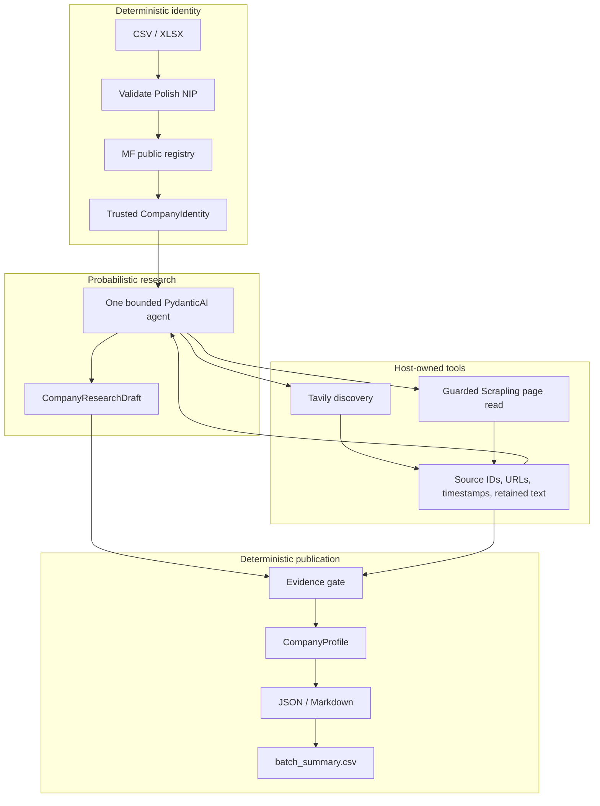

# Company BI

Company BI converts Polish NIPs into evidence-backed company intelligence profiles. One bounded **PydanticAI research agent proposes candidate knowledge; deterministic code decides what may be published**.

The engineering problem is not generating plausible JSON. It is preserving legal identity, provenance and uncertainty when web evidence is incomplete or model output is wrong. This small v0.1 makes that boundary inspectable rather than claiming production readiness. Follow the [10-minute reviewer guide](REVIEWER_GUIDE.md).

## Quick deterministic verification

Requires `uv`; setup selects Python 3.12 and may download it and dependencies. **No Tavily key or model credentials are required.** Tests, evaluation and offline review need no login, browser installation or prior run state.

```sh
uv sync --frozen --python 3.12
uv run --frozen pytest -q
uv run --frozen company-bi eval --dataset examples/evals/dataset.json --output-dir outputs/evals
uv run --frozen python scripts/review_offline.py --output-dir outputs/review
```

Evaluation prints the frozen counts and writes `outputs/evals/results.md` plus JSON. The helper writes provenance-labeled examples below. Setup download time is separate from the short offline checks.

## Architecture



The model chooses searches, sources and candidate interpretations—not which legal entity the user meant. Host tools assign source IDs and retain metadata/text. Research citations must reference that ledger; supported research requires exact retained full-page excerpts and claim-specific entity/context checks. **Pydantic structured output validates shape, not truth.** Gate and renderers make no model calls. Batch isolates failures and checkpoints on the filesystem.

Per-company ceilings: 180 seconds, 6 searches, 10 page reads, 2 browser attempts, 12 model requests, 24 tool calls and one output repair. [Architecture decisions](docs/ARCHITECTURE_DECISIONS.md#og-152-bounded-research-implementation) record the bounds and trust tradeoffs.

## Example output

Run the helper above, then open `outputs/review/review-manifest.json` and:

| Example | Generated artifact | Provenance |
| --- | --- | --- |
| COMPLETE | `outputs/review/controlled/synthetic-complete.md` and `.json` | **CONTROLLED FIXTURE** from `examples/profiles/complete.json`; not real yield |
| PARTIAL | `outputs/review/retained/asseco-poland.md` and `.json` | **REAL RETAINED RUN**, republished through the current gate |
| FAILED | `outputs/review/controlled/provider-interruption-research.json` | **CONTROLLED FAILURE**, one guarded local FunctionModel interruption; no final profile/report |

The real Asseco replay lacks sufficient legal-entity/context evidence; financial values stay null. PARTIAL is intentional, not a crash. The helper also renders LPP/ORLEN. No live calls or generated artifacts need committing.

Sample input: [`examples/research_batch.csv`](examples/research_batch.csv) contains public Asseco, LPP and ORLEN NIPs for optional live batches. [`examples/nips.csv`](examples/nips.csv) is the helper's validation demonstration: public Asseco NIP, invalid `123`, and a synthetic fixture identifier. Checksum validity alone is not identity resolution.

## Evidence semantics

`supported`: eligible retained evidence verifies the claim and context. `uncertain`: evidence/candidate exists but cannot justify support. `unknown`: insufficient evidence; value is null, never a guessed zero/false.

`COMPLETE` means core coverage has no gap or limitation; `PARTIAL` is valid with gaps/uncertainties/unknowns; `FAILED` means no safe final profile. Unresolved/invalid identity outcomes are distinct. A research diagnostic of `completed` is not a COMPLETE profile.

## Evaluation results

The selected diagnostic set has **12 cases** (9 controlled, 3 retained-real), not a representative sample. Frozen OG-154A results:

| Measure | Result |
| --- | ---: |
| Overall supported precision | 47/47 |
| Registry supported precision | 42/42 |
| Researched supported precision | 5/5 |
| Eligible researched recall | 5/19 |
| Unsupported facts published as supported | 0 |
| Identity correctness | 10/10 |
| Correct uncertainty handling | 28/28 |
| Correct strict unknown handling | 40/41 |
| Retained-real eligible researched yield | **0/7** |
| Retained real profiles | **0 COMPLETE / 3 PARTIAL / 0 FAILED** |

**5/5 does not establish production precision; 5/19 is low coverage.** This deliberately small evaluation set does not establish population-level production accuracy.

## What the evaluation changed

**Measure → classify retrieval/extraction/gate/unavailable-context losses → regression-first corrections → rerun the frozen benchmark.** Eligible recall moved **2/19 (10.5%) → 5/19 (26.3%)**, with false-supported **0 → 0**. All three recoveries were controlled; real yield stayed **0/7**. Exact-excerpt admission and narrow entity attachment improved without weakening financial/date/source rules. The eligible-miss and broader retrieval-loss populations are separate. [Results](docs/EVAL_RESULTS.md) · [failure analysis and corrections](docs/RECALL_RECOVERY.md).

A historical live LPP run failed at the single repair ceiling; its exact cause is unrecoverable. The [paired Scrapling experiment](docs/SCRAPLING_EXPERIMENT.md) found **no additional published supported facts**; only one pair exercised retrieval. Scrapling remains the full-page mechanism, but its supported-fact advantage was **not demonstrated**.

## Optional live research

Export `TAVILY_API_KEY` through your usual secret-management method, then use standard `codex login`. The tested path is **`openai-codex:gpt-6-luna`**, with SDK-managed authentication and no required `OPENAI_API_KEY`. An explicitly selected `openai:` model requires `OPENAI_API_KEY`; this is not a provider-agnostic validation claim. Optional [`.env.example`](.env.example) contains placeholders only: create an ignored `.env` without overwriting existing configuration, then explicitly add `--env-file .env` to `uv run` if using it. Never commit keys or auth caches.

Using the existing public three-NIP batch example:

```sh
uv run --frozen company-bi batch examples/research_batch.csv --output-dir outputs --runs-dir runs --model openai-codex:gpt-6-luna
```

Live mode contacts MF, Tavily, websites and the model; costs, availability and results vary. The [post-hardening Asseco smoke](docs/CLEAN_CLONE_AUDIT.md#single-final-live-smoke) exercised the full path and produced valid PARTIAL JSON/Markdown with zero supported researched facts. It was not rerun for packaging. `research` emits a draft/run; `batch` emits final reports and `batch_summary.csv`, with retained research under `runs/`.

## What this project does not claim

Not production SaaS or multi-tenant; not a complete Polish financial-data platform, universal web extraction, population-level precision proof, multi-agent orchestration, universal Scrapling improvement, or resolution of every fact. Real-company researched yield remains weak/unproven. Retrieved **PDF/XML/archive/Office financial parsing is unsupported** (CSV/XLSX NIP input works). Provider/web variability remains. URL/DNS checks do **not** eliminate SSRF: DNS rebinding/TOCTOU is residual risk.

## Repository map

- `src/company_bi/agent.py` — bounded research; `search.py` / `fetch.py` — Tavily / guarded retrieval.
- `src/company_bi/sources.py` — host ledger; `evidence.py` — publication gate; `renderer.py` — JSON/Markdown; `batch.py` — failure-isolated, resumable batches.
- `examples/` — input, controlled fixtures and retained public runs; `tests/` — deterministic regressions.
- `docs/` — [eval methodology](docs/EVAL_SPEC.md), [results](docs/EVAL_RESULTS.md), [recovery](docs/RECALL_RECOVERY.md), [clean-clone audit](docs/CLEAN_CLONE_AUDIT.md), [Scrapling experiment](docs/SCRAPLING_EXPERIMENT.md).

Licensed under the [MIT License](LICENSE), copyright © 2026 Tomasz Gonczar. The [clean-clone audit](docs/CLEAN_CLONE_AUDIT.md) records local verification; check [GitHub Actions CI](https://github.com/TomaszGonczar/company-bi-research-agent/actions/workflows/ci.yml) for the hosted result of the commit being reviewed. Local checks are not GitHub Actions evidence.
